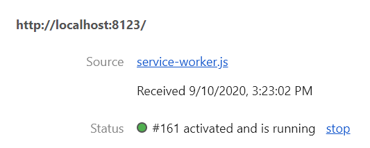
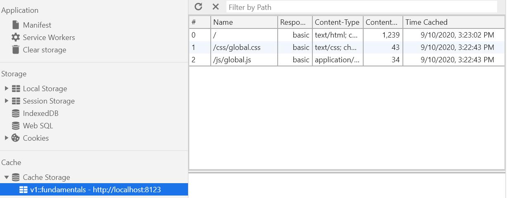
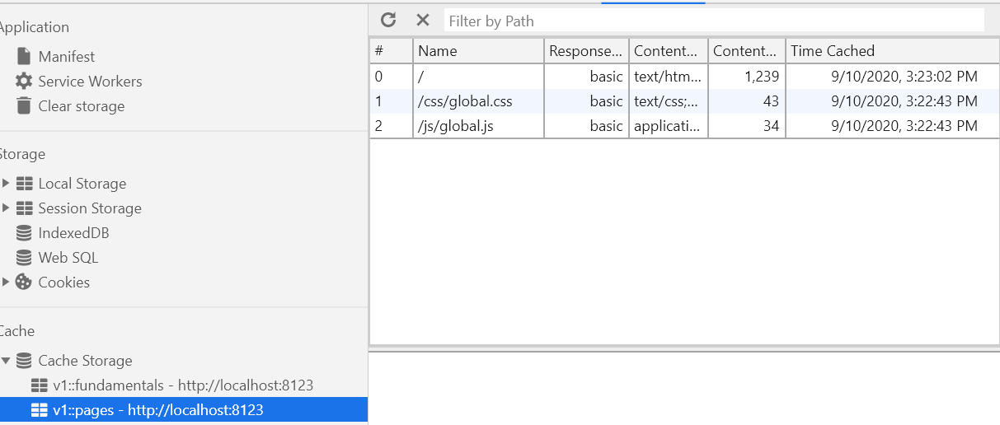
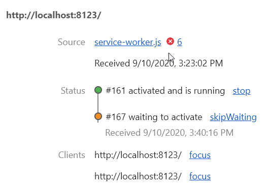
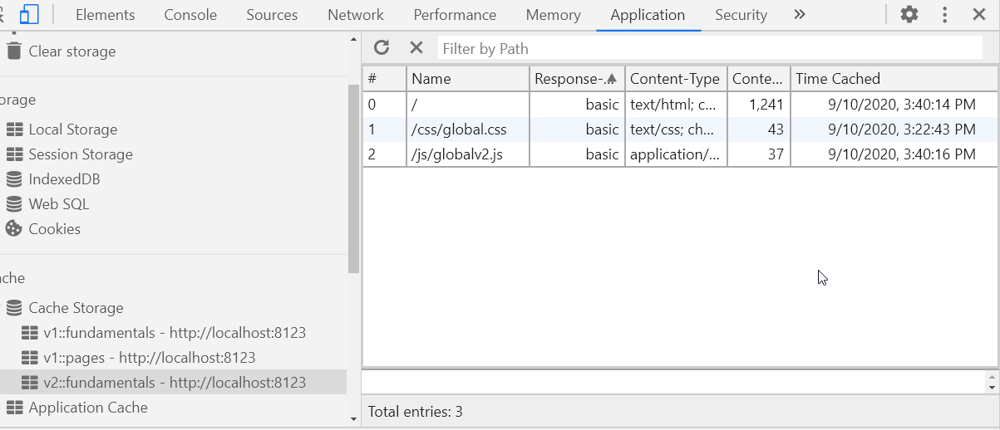
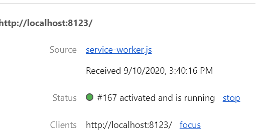
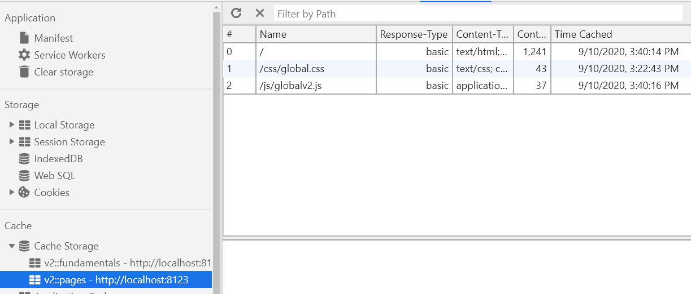

# JavaScript Hoisting

## JavaScript Declarations are Hoisted
In JavaScript, a variable can be declared after it has been used. In other words; a variable can be used before it has been declared.
To understand this, you have to understand the term "hoisting".   
__Hoisting is JavaScript's default behavior of moving all declarations to the top of the current scope (to the top of the current script or the current function).__

## JavaScript Initializations are Not Hoisted
JavaScript only hoists declarations, not initializations.

## Strict Mode
Thanks to a utility of the es5 version of JavaScript known as strict-mode, we can be more careful about how we declare our variables.
By enabling strict mode, we opt into a restricted variant of JavaScript that will not tolerate the usage of variables if they are not explicate declared.      
NOTE: hoisting is still working but if declaration is missing at all we will ger an error in run time. It means that
implicate declarations are disabled!

### ECMAScript 6 - let
Variables declared with the keyword let are block scoped and not function scoped.   
That's significant, but it shouldn't trouble us.   Briefly, however, it just means that the variable's scope is bound to the block in which it is declared and not the function in which it is declared.   
      
## Hoisting classes
Classes are hoisted but they are not initialised! It means that we cannot create instance of a class if class initialization was not executed!
NOTE: some people say that because of this we should say that they are not hoisted :)

https://www.w3schools.com/js/js_hoisting.asp   
https://stackoverflow.com/questions/35537619/why-are-es6-classes-not-hoisted    
https://blog.thoughtram.io/angular/2015/09/03/forward-references-in-angular-2.html     
https://scotch.io/tutorials/understanding-hoisting-in-javascript   

## null-vs-undefined
undefined means a variable has been declared but has not yet been assigned a value.
On the other hand, null is an assignment value. It can be assigned to a variable as a representation of no value.
Also, undefined and null are two distinct types: undefined is a type itself (undefined) while null is an object.

## merge-objects

# Date and Time
https://www.codementor.io/ayushgupta/date-and-time-in-javascript-fg1zamk72

> Where new Date() is called with more than one argument, the specifed arguments represent local time. When called with one argument, it simply uses that as count of milliseconds from epoch(UTC or local doesn't matter here).

https://developer.mozilla.org/en-US/docs/Web/JavaScript/Reference/Global_Objects/Date

> Where Date is called as a constructor with more than one argument, the specified arguments represent local time. If UTC is desired, use new Date(Date.UTC(...)) with the same arguments.

https://developer.mozilla.org/en-US/docs/Web/JavaScript/Reference/Global_Objects/Date/UTC

# workers

[General article](https://bitsofco.de/web-workers-vs-service-workers-vs-worklets/)   
[Service worker](https://css-tricks.com/serviceworker-for-offline/)

## web workers
Web workers can be used to offload pretty much any heavy processing from the main thread.

Listening events from web worker can be implemented in 2 ways:
```js
worker.addEventListener('message', workerMessaged);
```
or
```js
worker.onmessage = workerMessaged;
```
Listening events by web worker can be also implemented in 2 ways:
```js
self.addEventListener('message', (ev) => { ... });
```
or
```js
self.onmessage =  function(ev) { ... }
```

## service worker
Service workers are a type of worker that serve the explicit purpose of being a proxy between the browser and the network and/or cache.   

Once intercepted, a service worker can, for example, respond by returning a document from the cache instead of going to the network, thereby allowing web applications to function offline!

Events:
* install: the install event fires when a ServiceWorker is first fetched. This is your chance to prime the ServiceWorker cache with the fundamental resources that should be available even while users are offline.
* fetch: the fetch event fires whenever a request originates from your ServiceWorker scope, and you’ll get a chance to intercept the request and respond immediately, without going to the network. **This event is not triggered when page is load first time in web browser** - probably anyway all files have to be downloaded from the server.
* activate: the activate event fires after a successful installation. You can use it to phase out older versions of the worker. We’ll look at a basic example where we deleted stale cache entries.
  
**Service worker scope**: by default scope of service worker is the same as its location. It means that if ```service-worker.js``` is in the root folder then all requests will be intercepted by this service worker. If needed during registration we can narrow the scope for example:
```js
navigator.serviceWorker.register('/service-worker.js', {
    scope: '/app/'
})
```
### service worker life cycle

Service workers maintain control as long as there are pages open that are dependant on that specific version. This ensures that **only one version of the service worker is running at any given time**. If a new service worker is installed on a page with an existing service worker, the new service worker will not tak over until the existing service worker is removed. Old service workers will be become redundant and be deleted once all pages using it are closed. This will activate the new service worker and allow it to take over. Refreshing the page is not sufficient to transfer the control to a new service worker, because there won`t be a time when old service worker is not in use. The activation event is a good time to clean up stale data from existing caches for the application. Note that activation of a new service worker can be force programmatically with ```self.skipWaiting()```.

Example:

1. Open page first time, service worker v1 is installed and activated. Cache is populated.
   
   
2. Open the same page in the second tab, the same service worker is used. Installation and  activation events are fired.
   
   
3. Change version of the service-worker to v2 and load ```globalv2.js``` file. Open the page in third tab.
   
   
4. Close all 3 tabs that were using v1 of the service worker.
5. Open the app in a new tab. This time v2 of the service worker is used and cache does not contain any more obsolete data. See that global.css is still the same version that was cached in step 1 (3:22:43 PM).
   
   

## worklets

Worklets are a very lightweight, highly specific, worker. They enable us as developers to hook into various parts of the browser’s rendering process.

```js
/* main.js */

CSS.paintWorklet.addModule('myWorklet.js');
```

```js
/* myWorklet.js */

registerPaint('myGradient', class {
  paint(ctx, size, properties) {
    var gradient = ctx.createLinearGradient(0, 0, 0, size.height / 3);

    gradient.addColorStop(0, "black");
    gradient.addColorStop(0.7, "rgb(210, 210, 210)");
    gradient.addColorStop(0.8, "rgb(230, 230, 230)");
    gradient.addColorStop(1, "white");

    ctx.fillStyle = gradient;
    ctx.fillRect(0, 0, size.width, size.height / 3);
  }
});
```

```css
div {
    background-image: paint(myGradient);
}
```

# function calls: apply and call

[example](./function-call/index.html)

>"The difference is that apply lets you invoke the function with arguments as an array; call requires the parameters be listed explicitly. A useful mnemonic is "A for array and C for comma.""

```js
theFunction.apply(valueForThis, arrayOfArgs)

theFunction.call(valueForThis, arg1, arg2, ...)
```